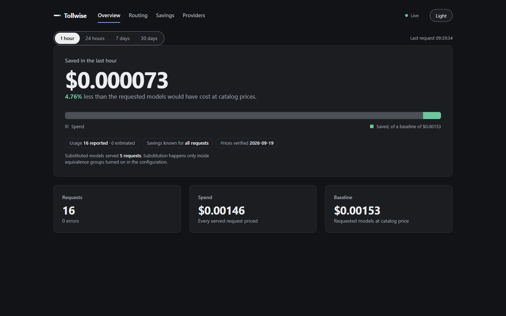

# Dashboard

While Tollwise runs, open **`http://127.0.0.1:8484/dashboard`** in a browser (with your own port if
you changed `server.port`). The dashboard is served by Tollwise itself, from the same address: it
loads nothing from any other site and reads only the local, read-only `/api/*` endpoints and the
live `/api/events` stream described in [`api.md`](api.md#api--local-read-only).

```
$ curl -s -o /dev/null -w "%{http_code} %{content_type}\n" http://127.0.0.1:8484/dashboard
200 text/html; charset=utf-8
```



## Views

- **Overview:** money saved, spend and the baseline (what the requested models would have cost at
  catalog prices) over the last hour, 24 hours, 7 days or 30 days, and how many requests a
  substituted model served.
- **Routing:** the latest requests with the provider and model that served each one. Open a request
  to see its routing trace: every provider tried, with its outcome, HTTP status and duration, and,
  for a substituted request, the model you asked for, the model that answered and the equivalence
  group that allowed it.
- **Savings:** savings and spend over time, and spend by provider and by model.
- **Providers:** the health and p50/p95 latency of each monitored provider.

The views update live while the page is open. The theme follows your system setting until you pick
one with the button in the header. Screenshots of every view, at 1440 and 390 pixels wide and in
both themes, are in [`images/`](images/); [`accessibility.md`](accessibility.md) describes how they
are taken and checked.

## With an access key

When `TOLLWISE_ACCESS_KEY` is set, the page itself still loads without it (it holds no data), and
the dashboard asks for the key in an "Enter the access key" form as soon as the API answers `401`.
Paste the value of `TOLLWISE_ACCESS_KEY` and press Enter. The dashboard keeps the key only in that
browser tab's session storage, so it is gone when the tab closes, and sends it only in a request
header, never in the address bar, a cookie or `localStorage`. A wrong key brings the form back with
"That key was not accepted."

## What it shows, and where the data lives

The dashboard shows the local analytics database, by default `data/analytics.db` under the directory
Tollwise was started from: metadata about each request, never a prompt or an answer.
[`privacy.md`](privacy.md) lists exactly what is stored, how to delete it and how to turn it off.
With analytics off, the dashboard shows the `analytics_disabled` message in place of its metrics.

To try it with traffic and no provider key, run `npm run demo` and open the dashboard address it
prints (it keeps sending requests until Ctrl+C); see [`demo.md`](demo.md) for a full walkthrough
with real output.
