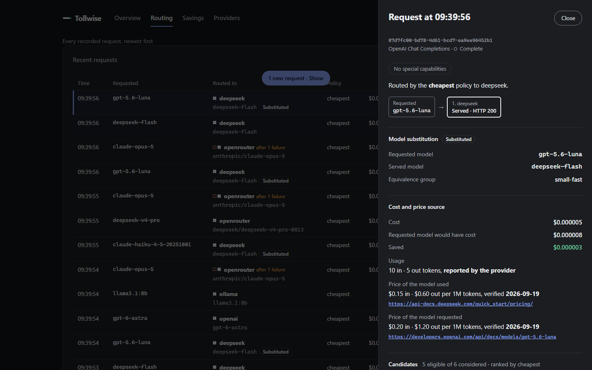

# A local walkthrough, command by command

This page shows Tollwise running on one machine: checking a configuration, starting the proxy, answering two chat requests (one of them served by an equivalent, cheaper model), reporting them through the metrics API, and running the built-in demo. Every command was run in the order shown, from the repository root, on 2026-09-25.

Every output block is the unedited output of the command above it, with two exceptions: the full path of the repository on the machine that ran it is shortened to `<repository root>`, and the text is shown with Unix line endings.

No real provider and no real key are involved. Two instances of the local HTTP stand-in in [`test/fixtures/mock-provider.ts`](../test/fixtures/mock-provider.ts), the same one the automated tests use, took the place of the OpenAI and DeepSeek APIs. Each one listens on a free port on `127.0.0.1` and answered each chat request below with the text "Mock response from the mock provider." and a usage of 10 input and 5 output tokens. Costs and savings below are computed from those token counts and the real catalog prices; the answers themselves come from the stand-ins.

## 1. The configuration

`tollwise.yaml` in the repository root enables the two providers, points them at the stand-ins, and turns on the `small-fast` [equivalence preset](equivalence-presets.md), so a request for one model of that class may be served by a cheaper model of the same class:

```yaml
# Two providers, both pointed at local stand-ins instead of their real APIs.
providers:
  openai:
    base_url: http://127.0.0.1:51457/v1
  deepseek:
    base_url: http://127.0.0.1:51458/v1
  anthropic:
    enabled: false
  openrouter:
    enabled: false
  ollama:
    enabled: false

routing:
  policy: cheapest
  # Opt-in model substitution inside the small-fast class (docs/equivalence-presets.md).
  equivalence_presets: [small-fast]
```

The two provider keys were set to fake values in the shell (in PowerShell: `$env:OPENAI_API_KEY = "fake-openai-key"`):

```
export OPENAI_API_KEY="fake-openai-key"
export DEEPSEEK_API_KEY="fake-deepseek-key"
```

## 2. Check the configuration

```
$ node src/cli.ts config check
OK: configuration is valid.
Config file: tollwise.yaml (found in the current directory)
Environment overrides: none

Effective configuration:
server:
  host: 127.0.0.1
  port: 8484
  max_body_size: 20mb
  allowed_hosts: []
  access_key: missing (TOLLWISE_ACCESS_KEY)
providers:
  anthropic:
    enabled: false
    base_url: https://api.anthropic.com
    api_key_env: ANTHROPIC_API_KEY
    api_key: missing
  openai:
    enabled: true
    base_url: http://127.0.0.1:51457/v1
    api_key_env: OPENAI_API_KEY
    api_key: set
  deepseek:
    enabled: true
    base_url: http://127.0.0.1:51458/v1
    api_key_env: DEEPSEEK_API_KEY
    api_key: set
  openrouter:
    enabled: false
    base_url: https://openrouter.ai/api/v1
    api_key_env: OPENROUTER_API_KEY
    api_key: missing
  ollama:
    enabled: false
    base_url: http://127.0.0.1:11434
    api_key_env: null
    api_key: not required
routing:
  policy: cheapest
  on_no_candidate: passthrough
  equivalence_groups: []
  equivalence_presets:
    - name: small-fast
      models:
        - claude-haiku-4.5
        - gpt-5.6-luna
        - deepseek-v4.1-flash
  retries: 1
  timeouts:
    connect_ms: 5000
    first_byte_ms: 120000
    total_ms: 600000
analytics:
  enabled: true
  store_prompts: false
  path: data/analytics.db
logging:
  level: info
```

The keys are never printed: `config check` only says whether each one is set. The preset shows its three member models.

## 3. Start the proxy

```
$ npm start

> tollwise@0.1.0 start
> node src/cli.ts

{"time":"2026-09-25T08:44:33.129Z","level":"info","msg":"Tollwise is ready on http://127.0.0.1:8484","url":"http://127.0.0.1:8484","access":"no key","analytics":"<repository root>\\data\\analytics.db"}
{"time":"2026-09-25T08:44:33.145Z","level":"info","msg":"provider health transitioned to up","component":"health-monitor","provider":"openai","from":"unknown","to":"up"}
{"time":"2026-09-25T08:44:33.146Z","level":"info","msg":"provider health transitioned to up","component":"health-monitor","provider":"deepseek","from":"unknown","to":"up"}
{"time":"2026-09-25T08:44:33.840Z","level":"info","msg":"request","method":"GET","path":"/healthz","status":200,"duration_ms":2.1}
{"time":"2026-09-25T08:44:43.441Z","level":"info","msg":"request","method":"GET","path":"/healthz","status":200,"duration_ms":0.77}
{"time":"2026-09-25T08:44:43.490Z","level":"info","msg":"request","method":"POST","path":"/v1/chat/completions","status":200,"duration_ms":20.43}
{"time":"2026-09-25T08:44:43.522Z","level":"info","msg":"request","method":"POST","path":"/v1/chat/completions","status":200,"duration_ms":4.26}
{"time":"2026-09-25T08:44:49.860Z","level":"info","msg":"request","method":"GET","path":"/api/metrics/summary","status":200,"duration_ms":2.62}
{"time":"2026-09-25T08:44:49.887Z","level":"info","msg":"request","method":"GET","path":"/api/requests","status":200,"duration_ms":1.55}
```

This is the complete log, from start until the proxy was stopped after step 6; it logs to stderr, one JSON object per line. The `request` lines were written while the commands of steps 4 to 6 ran. The first `/healthz` line comes from a readiness check made before step 4.

## 4. Liveness

From a second terminal:

```
$ curl -s http://127.0.0.1:8484/healthz
{"status":"ok"}
```

## 5. Two chat requests

A request for `gpt-6-astra`, which no preset covers. The only candidate is OpenAI itself, so the request goes there unchanged and `x-tollwise-substituted` is `false`:

```
$ curl -s -D - -X POST http://127.0.0.1:8484/v1/chat/completions \
  -H "Content-Type: application/json" \
  -d '{"model":"gpt-6-astra","messages":[{"role":"user","content":"Say hello in one short sentence."}]}'
HTTP/1.1 200 OK
content-type: application/json
content-length: 291
date: Fri, 25 Sep 2026 08:44:43 GMT
x-tollwise-request-id: 2d914d84-b950-4d6f-b5f9-759565c0aa63
x-tollwise-provider: openai
x-tollwise-model: gpt-6-astra
x-tollwise-policy: cheapest
x-tollwise-routed: true
x-tollwise-attempts: 1
x-tollwise-translated: false
x-tollwise-requested-model: gpt-6-astra
x-tollwise-substituted: false
x-tollwise-cost-usd: 0.000350
x-tollwise-savings-usd: 0.000000
x-tollwise-cost-origin: reported
x-tollwise-price-verified-on: 2026-09-19
Connection: keep-alive
Keep-Alive: timeout=5

{"id":"chatcmpl-mock-1","object":"chat.completion","created":1790325883,"model":"gpt-6-astra","choices":[{"index":0,"message":{"role":"assistant","content":"Mock response from the mock provider."},"finish_reason":"stop"}],"usage":{"prompt_tokens":10,"completion_tokens":5,"total_tokens":15}}
```

A request for `gpt-5.6-luna`, a member of the `small-fast` preset. The cheapest candidate is DeepSeek's `deepseek-flash`, a member of the same preset, so Tollwise serves the request with it and says so in the headers: `x-tollwise-requested-model` is the model that was asked for, `x-tollwise-model` the model that answered, `x-tollwise-substituted` is `true` and `x-tollwise-equivalence-group` names the group. `x-tollwise-savings-usd` is the difference from the price of `gpt-5.6-luna` at OpenAI:

```
$ curl -s -D - -X POST http://127.0.0.1:8484/v1/chat/completions \
  -H "Content-Type: application/json" \
  -d '{"model":"gpt-5.6-luna","messages":[{"role":"user","content":"Say hello in one short sentence."}]}'
HTTP/1.1 200 OK
content-type: application/json
content-length: 294
date: Fri, 25 Sep 2026 08:44:43 GMT
x-tollwise-request-id: 9dfe369e-8575-40ca-be01-b8e8a512bdab
x-tollwise-provider: deepseek
x-tollwise-model: deepseek-flash
x-tollwise-policy: cheapest
x-tollwise-routed: true
x-tollwise-attempts: 1
x-tollwise-translated: false
x-tollwise-requested-model: gpt-5.6-luna
x-tollwise-substituted: true
x-tollwise-equivalence-group: small-fast
x-tollwise-cost-usd: 0.000005
x-tollwise-savings-usd: 0.000003
x-tollwise-cost-origin: reported
x-tollwise-price-verified-on: 2026-09-19
Connection: keep-alive
Keep-Alive: timeout=5

{"id":"chatcmpl-mock-2","object":"chat.completion","created":1790325883,"model":"deepseek-flash","choices":[{"index":0,"message":{"role":"assistant","content":"Mock response from the mock provider."},"finish_reason":"stop"}],"usage":{"prompt_tokens":10,"completion_tokens":5,"total_tokens":15}}
```

Without `equivalence_presets` (the default), this configuration would have sent the second request to OpenAI's `gpt-5.6-luna`: by default Tollwise only switches between providers of the model that was asked for.

## 6. The same two requests in the metrics API

The summary counts the substituted request in `substituted_requests`, and the stored request carries the substitution next to its routing trace. Neither holds the prompt or the answer:

```
$ curl -s "http://127.0.0.1:8484/api/metrics/summary?range=1h"
{"range":"1h","requests":2,"errors":0,"spend_usd":"0.000355","unpriced_requests":0,"baseline_usd":"0.000358","savings_usd":"0.000003","savings_percent":0.84,"unknown_savings_requests":0,"origin":{"reported":2,"estimated":0},"prices_verified_on":{"oldest":"2026-09-19","newest":"2026-09-19"},"substituted_requests":1}
$ curl -s "http://127.0.0.1:8484/api/requests?limit=1"
{"entries":[{"requestId":"9dfe369e-8575-40ca-be01-b8e8a512bdab","timestamp":"2026-09-25T08:44:43.521Z","status":"complete","route":{"format":"openai","requestedModel":"gpt-5.6-luna","requestedProvider":"openai","usedModel":"deepseek-flash","usedProvider":"deepseek","policy":"cheapest","decision":"routed"},"reason":"routed by the cheapest policy","cost_usd":"0.000005","savings_usd":"0.000003","trace":[{"provider":"deepseek","model":"deepseek-flash","outcome":"ok","status":200,"duration_ms":2}],"latency_ms":4,"first_byte_ms":null,"origin":"reported","baseline_usd":"0.000008","usage":{"input":10,"output":5},"needs":{"tools":false,"json_mode":false,"vision":false,"streaming":false},"price":{"used":{"input":0.15,"output":0.6,"verified_on":"2026-09-19","source_url":"https://api-docs.deepseek.com/quick_start/pricing/"},"requested":{"input":0.2,"output":1.2,"verified_on":"2026-09-19","source_url":"https://developers.openai.com/api/docs/models/gpt-5.6-luna"}},"selection":{"considered":6,"candidates":[{"provider":"deepseek","model":"deepseek-flash","input":0.15,"output":0.6},{"provider":"openai","model":"gpt-5.6-luna","input":0.2,"output":1.2}],"excluded":[{"provider":"anthropic","model":"claude-haiku-4-5-20251001","reason":"provider_not_configured"},{"provider":"openrouter","model":"anthropic/claude-haiku-4.5","reason":"provider_not_configured"},{"provider":"openrouter","model":"openai/gpt-5.6-luna","reason":"provider_not_configured"},{"provider":"openrouter","model":"deepseek/deepseek-v4.1-flash","reason":"provider_not_configured"}]},"substituted":true,"substitution":{"requested_model":"gpt-5.6-luna","served_model":"deepseek-flash","group":"small-fast"}}],"nextCursor":"1790325883521-2"}
```

The dashboard at `http://127.0.0.1:8484/dashboard` shows the same data. Opening a substituted request in the Routing view shows the requested model, the served model and the equivalence group (this screenshot was taken by `npm run verify:dashboard`, which runs the demo of step 7 and photographs its traffic, not the two requests above):



## 7. The built-in demo

`npm run demo` needs no configuration file and no key. It starts five stand-in providers of its own and a Tollwise instance on port 8487 (from [`examples/demo.yaml`](../examples/demo.yaml), which also turns on the `small-fast` preset), then sends a fixed mix of requests: both API formats, streaming, tools, JSON mode, vision, a local Ollama model, and scripted provider failures that make routing fall back to the next candidate. Without `--count` it keeps sending until Ctrl+C, so the dashboard stays live.

```
$ npm run demo -- --count 20

> tollwise@0.1.0 demo
> node scripts/demo.ts --count 20

tollwise demo: starting five local mock providers ...
tollwise demo: proxy ready at http://127.0.0.1:8487
tollwise demo: dashboard at http://127.0.0.1:8487/dashboard
tollwise demo: analytics stored at <repository root>\data\demo.db
tollwise demo: sending 20 request(s) ...
{"time":"2026-09-25T08:45:20.831Z","level":"info","msg":"provider health transitioned to up","component":"health-monitor","provider":"openai","from":"unknown","to":"up"}
{"time":"2026-09-25T08:45:20.832Z","level":"info","msg":"provider health transitioned to up","component":"health-monitor","provider":"deepseek","from":"unknown","to":"up"}
{"time":"2026-09-25T08:45:20.832Z","level":"info","msg":"provider health transitioned to up","component":"health-monitor","provider":"openrouter","from":"unknown","to":"up"}
{"time":"2026-09-25T08:45:20.835Z","level":"info","msg":"provider health transitioned to up","component":"health-monitor","provider":"ollama","from":"unknown","to":"up"}
{"time":"2026-09-25T08:45:20.841Z","level":"info","msg":"request","method":"POST","path":"/v1/messages","status":200,"duration_ms":21.27}
{"time":"2026-09-25T08:45:20.842Z","level":"info","msg":"provider health transitioned to up","component":"health-monitor","provider":"anthropic","from":"unknown","to":"up"}
[  1] anthropic-plain-haiku                -> 200 provider=deepseek model=deepseek-flash routed=true substituted=true attempts=1 savings=$0.000030
{"time":"2026-09-25T08:45:20.852Z","level":"info","msg":"request","method":"POST","path":"/v1/chat/completions","status":200,"duration_ms":7.27}
[  2] openai-vision                        -> 200 provider=deepseek model=deepseek-flash routed=true substituted=true attempts=1 savings=$0.000003
{"time":"2026-09-25T08:45:20.855Z","level":"info","msg":"request","method":"POST","path":"/v1/chat/completions","status":200,"duration_ms":2.01}
[  3] openai-local-ollama                  -> 200 provider=ollama model=llama3.1:8b routed=true substituted=false attempts=1 savings=$0.000000
{"time":"2026-09-25T08:45:20.857Z","level":"info","msg":"request","method":"POST","path":"/v1/chat/completions","status":200,"duration_ms":1.04}
[  4] openai-plain-cheapest-group          -> 200 provider=deepseek model=deepseek-flash routed=true substituted=true attempts=1 savings=$0.000003
{"time":"2026-09-25T08:45:20.860Z","level":"info","msg":"request","method":"POST","path":"/v1/chat/completions","status":200,"duration_ms":1.83}
[  5] openai-tools                         -> 200 provider=openai model=gpt-6-astra routed=true substituted=false attempts=1 savings=$0.000000
{"time":"2026-09-25T08:45:20.863Z","level":"warn","msg":"upstream call failed","provider":"anthropic","errorKind":"rate_limit","durationMs":1,"status":429}
{"time":"2026-09-25T08:45:20.863Z","level":"info","msg":"messages request falling back","requestId":"d1259f43-867f-42ea-96ce-59a245bf30bd","provider":"anthropic","errorKind":"rate_limit","next":"openrouter"}
{"time":"2026-09-25T08:45:20.866Z","level":"info","msg":"messages request attempts","requestId":"d1259f43-867f-42ea-96ce-59a245bf30bd","outcome":"complete","attempts":[{"provider":"anthropic","model":"claude-opus-5","outcome":"rate_limit","status":429,"duration_ms":2,"substitution":null},{"provider":"openrouter","model":"anthropic/claude-opus-5","outcome":"ok","status":200,"duration_ms":2,"substitution":null}]}
{"time":"2026-09-25T08:45:20.866Z","level":"info","msg":"request","method":"POST","path":"/v1/messages","status":200,"duration_ms":5.01}
[  6] anthropic-stream-opus-fallback       -> 200 provider=openrouter model=anthropic/claude-opus-5 routed=true substituted=false attempts=2
{"time":"2026-09-25T08:45:20.868Z","level":"warn","msg":"upstream call failed","provider":"anthropic","errorKind":"server","durationMs":1,"status":500}
{"time":"2026-09-25T08:45:20.868Z","level":"info","msg":"messages request falling back","requestId":"1b7f33f2-4b3d-4d86-85a9-fbfc0bfee157","provider":"anthropic","errorKind":"server","next":"openrouter"}
{"time":"2026-09-25T08:45:20.870Z","level":"info","msg":"messages request attempts","requestId":"1b7f33f2-4b3d-4d86-85a9-fbfc0bfee157","outcome":"complete","attempts":[{"provider":"anthropic","model":"claude-opus-5","outcome":"server","status":500,"duration_ms":1,"substitution":null},{"provider":"openrouter","model":"anthropic/claude-opus-5","outcome":"ok","status":200,"duration_ms":1,"substitution":null}]}
{"time":"2026-09-25T08:45:20.870Z","level":"info","msg":"request","method":"POST","path":"/v1/messages","status":200,"duration_ms":2.49}
[  7] anthropic-tools-stream-opus-fallback -> 200 provider=openrouter model=anthropic/claude-opus-5 routed=true substituted=false attempts=2
{"time":"2026-09-25T08:45:20.872Z","level":"info","msg":"request","method":"POST","path":"/v1/chat/completions","status":200,"duration_ms":0.96}
[  8] openai-json-mode                     -> 200 provider=openrouter model=deepseek/deepseek-v4-pro-0813 routed=true substituted=false attempts=1 savings=$0.000002
{"time":"2026-09-25T08:45:20.874Z","level":"info","msg":"request","method":"POST","path":"/v1/chat/completions","status":200,"duration_ms":1.39}
[  9] openai-stream-deepseek               -> 200 provider=deepseek model=deepseek-flash routed=true substituted=false attempts=1
{"time":"2026-09-25T08:45:20.875Z","level":"warn","msg":"upstream call failed","provider":"anthropic","errorKind":"rate_limit","durationMs":0,"status":429}
{"time":"2026-09-25T08:45:20.875Z","level":"info","msg":"messages request falling back","requestId":"478e6217-af12-460f-901a-776751db7a15","provider":"anthropic","errorKind":"rate_limit","next":"openrouter"}
{"time":"2026-09-25T08:45:20.876Z","level":"info","msg":"messages request attempts","requestId":"478e6217-af12-460f-901a-776751db7a15","outcome":"complete","attempts":[{"provider":"anthropic","model":"claude-opus-5","outcome":"rate_limit","status":429,"duration_ms":0,"substitution":null},{"provider":"openrouter","model":"anthropic/claude-opus-5","outcome":"ok","status":200,"duration_ms":0,"substitution":null}]}
{"time":"2026-09-25T08:45:20.876Z","level":"info","msg":"request","method":"POST","path":"/v1/messages","status":200,"duration_ms":1.54}
[ 10] anthropic-vision-opus-fallback       -> 200 provider=openrouter model=anthropic/claude-opus-5 routed=true substituted=false attempts=2 savings=$0.000000
{"time":"2026-09-25T08:45:20.878Z","level":"info","msg":"request","method":"POST","path":"/v1/messages","status":200,"duration_ms":0.79}
[ 11] anthropic-plain-haiku                -> 200 provider=deepseek model=deepseek-flash routed=true substituted=true attempts=1 savings=$0.000030
{"time":"2026-09-25T08:45:20.879Z","level":"info","msg":"request","method":"POST","path":"/v1/chat/completions","status":200,"duration_ms":0.8}
[ 12] openai-vision                        -> 200 provider=deepseek model=deepseek-flash routed=true substituted=true attempts=1 savings=$0.000003
{"time":"2026-09-25T08:45:20.881Z","level":"info","msg":"request","method":"POST","path":"/v1/chat/completions","status":200,"duration_ms":0.64}
[ 13] openai-local-ollama                  -> 200 provider=ollama model=llama3.1:8b routed=true substituted=false attempts=1 savings=$0.000000
{"time":"2026-09-25T08:45:20.882Z","level":"info","msg":"request","method":"POST","path":"/v1/chat/completions","status":200,"duration_ms":0.8}
[ 14] openai-plain-cheapest-group          -> 200 provider=deepseek model=deepseek-flash routed=true substituted=true attempts=1 savings=$0.000003
{"time":"2026-09-25T08:45:20.883Z","level":"info","msg":"request","method":"POST","path":"/v1/chat/completions","status":200,"duration_ms":0.73}
[ 15] openai-tools                         -> 200 provider=openai model=gpt-6-astra routed=true substituted=false attempts=1 savings=$0.000000
{"time":"2026-09-25T08:45:20.884Z","level":"warn","msg":"upstream call failed","provider":"anthropic","errorKind":"server","durationMs":0,"status":500}
{"time":"2026-09-25T08:45:20.885Z","level":"info","msg":"messages request falling back","requestId":"53f41c14-2e91-4981-ab9e-f91ca82a4d94","provider":"anthropic","errorKind":"server","next":"openrouter"}
{"time":"2026-09-25T08:45:20.885Z","level":"info","msg":"messages request attempts","requestId":"53f41c14-2e91-4981-ab9e-f91ca82a4d94","outcome":"complete","attempts":[{"provider":"anthropic","model":"claude-opus-5","outcome":"server","status":500,"duration_ms":0,"substitution":null},{"provider":"openrouter","model":"anthropic/claude-opus-5","outcome":"ok","status":200,"duration_ms":1,"substitution":null}]}
{"time":"2026-09-25T08:45:20.886Z","level":"info","msg":"request","method":"POST","path":"/v1/messages","status":200,"duration_ms":1.64}
[ 16] anthropic-stream-opus-fallback       -> 200 provider=openrouter model=anthropic/claude-opus-5 routed=true substituted=false attempts=2
{"time":"2026-09-25T08:45:20.887Z","level":"warn","msg":"upstream call failed","provider":"anthropic","errorKind":"rate_limit","durationMs":0,"status":429}
{"time":"2026-09-25T08:45:20.887Z","level":"info","msg":"messages request falling back","requestId":"965723f1-5ef5-475c-9983-029239bb5490","provider":"anthropic","errorKind":"rate_limit","next":"openrouter"}
{"time":"2026-09-25T08:45:20.888Z","level":"info","msg":"messages request attempts","requestId":"965723f1-5ef5-475c-9983-029239bb5490","outcome":"complete","attempts":[{"provider":"anthropic","model":"claude-opus-5","outcome":"rate_limit","status":429,"duration_ms":0,"substitution":null},{"provider":"openrouter","model":"anthropic/claude-opus-5","outcome":"ok","status":200,"duration_ms":0,"substitution":null}]}
{"time":"2026-09-25T08:45:20.888Z","level":"info","msg":"request","method":"POST","path":"/v1/messages","status":200,"duration_ms":1.55}
[ 17] anthropic-tools-stream-opus-fallback -> 200 provider=openrouter model=anthropic/claude-opus-5 routed=true substituted=false attempts=2
{"time":"2026-09-25T08:45:20.889Z","level":"info","msg":"request","method":"POST","path":"/v1/chat/completions","status":200,"duration_ms":0.69}
[ 18] openai-json-mode                     -> 200 provider=openrouter model=deepseek/deepseek-v4-pro-0813 routed=true substituted=false attempts=1 savings=$0.000002
{"time":"2026-09-25T08:45:20.891Z","level":"info","msg":"request","method":"POST","path":"/v1/chat/completions","status":200,"duration_ms":0.95}
[ 19] openai-stream-deepseek               -> 200 provider=deepseek model=deepseek-flash routed=true substituted=false attempts=1
{"time":"2026-09-25T08:45:20.892Z","level":"warn","msg":"upstream call failed","provider":"anthropic","errorKind":"server","durationMs":0,"status":500}
{"time":"2026-09-25T08:45:20.892Z","level":"info","msg":"messages request falling back","requestId":"b8b9aa72-7129-4985-b7ed-15e166754906","provider":"anthropic","errorKind":"server","next":"openrouter"}
{"time":"2026-09-25T08:45:20.893Z","level":"info","msg":"messages request attempts","requestId":"b8b9aa72-7129-4985-b7ed-15e166754906","outcome":"complete","attempts":[{"provider":"anthropic","model":"claude-opus-5","outcome":"server","status":500,"duration_ms":1,"substitution":null},{"provider":"openrouter","model":"anthropic/claude-opus-5","outcome":"ok","status":200,"duration_ms":0,"substitution":null}]}
{"time":"2026-09-25T08:45:20.893Z","level":"info","msg":"request","method":"POST","path":"/v1/messages","status":200,"duration_ms":1.44}
[ 20] anthropic-vision-opus-fallback       -> 200 provider=openrouter model=anthropic/claude-opus-5 routed=true substituted=false attempts=2 savings=$0.000000
tollwise demo: sent 20 request(s); stopped cleanly.
```

Each numbered line is one request: the scenario, the HTTP status, the provider and model that served it, whether the model was substituted, how many providers were called, and the savings reported in `x-tollwise-savings-usd` (streamed answers carry no cost headers, so their lines have none). The demo keeps its history in `data/demo.db`, separate from `data/analytics.db`.
